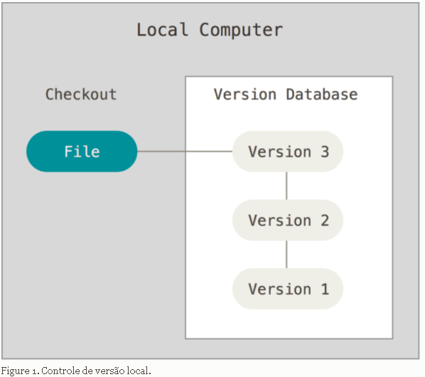
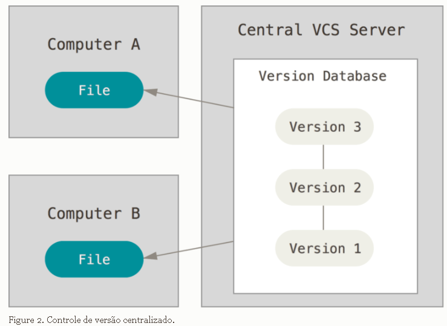
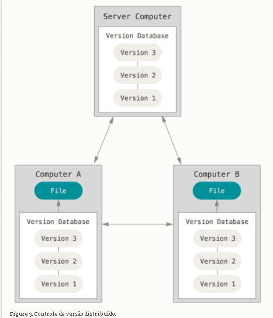
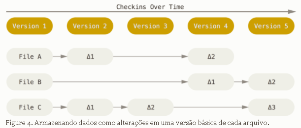
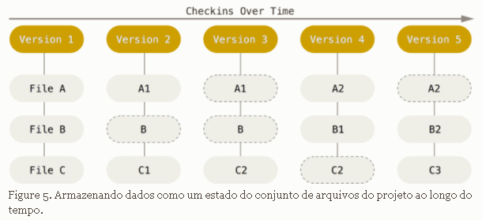
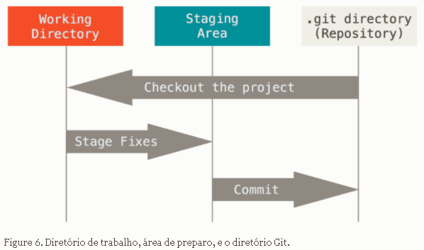

<h1>GIT</h1>

### O que é o GIT ?

Git é um software de **controle de versão distribuído** cuja finalidade é monitorar seus arquivos e gerar um histórico de mudanças de maneira organizada e eficiente. Fazer o que o Git faz de forma manual é ineficiente, difícil e o resultado final seria uma bagunça.

Devido ao histórico gerado pelo git, é possível revisitar o seu código em várias fases diferentes de desenvolvimento e se for o caso retrocedê-lo  para algum ponto no passado.

### Tipos de softwares de versionamento

----

​    O Git não foi o primeiro software de versionamento disponível no mercado. Antes dele, Subversion, CVS e outros já ofereciam o controle de versão através de diferentes estruturas. Nesta seção é apresentada algumas estruturas de software de versionamento.

##### Sistemas de controle de versão locais

Possuem um banco de dados na máquina local responsável por armazenar as mudanças dos arquivos. 

**Exemplo** : RCS

##### Sistemas de controle de versão centralizado (CVCs)

Nesta arquitetura, o banco de dados que guarda as diferentes versões dos arquivos está localizado em um servidor remoto central e os clientes recuperam os arquivos versionados deste servidor.

Esse sistema oferece algumas vantagens e desvantagens. A vantagem principal de um VCS central é a possibilidade de colaboração entre desenvolvedores, uma vez que todos podem visualizar o estado atual e anterior do projeto. Já a grande desvantagem, é o único ponto de falha que sistema representa, uma vez que se o servidor parar de funcionar por uma hora, neste período , nenhum colaborador poderá salvar as alterações feitas no projeto.

**Exemplo** : CVS, Subversion e Perforce.

##### Sistemas de controle de versão distribuídos (DVCSs)

 Em um modelo distribuído, cada cliente contribuindo através de um  servidor central pode também ter uma cópia completa do projeto presente no servidor em sua máquina local. Ter um cópia do completa do projeto significa que o banco de dados que guarda as alterações do projeto pode ser copiado e mantido localmente . Dessa forma, qualquer cliente poderia subir sua versão como backup caso o projeto se corrompe  no servidor.

**exemplos**: Git, Mercurial, Bazaar ou Darcs

---

### Algumas características do Git

##### Como o git armazena seus dados ?

O git armazena e pensa os dados de uma forma diferente se comparado a outros VCSs. Em outros programas de versionamento é considerado um arquivos base e cada alteração gera um arquivo novo,  representando uma versão diferente.

 

No git , cada vez que  um commit é realizado é como se foto fosse tirada de todos seus arquivos e a referência  a esse conjunto de arquivos é armazenada na sua base de dados. Caso um arquivo não tenha sido alterado de uma versão para outra , o git não salvará esse arquivo novamente, ao em vez disso somente a ultima versão será recuperada e mantida.

O git , também:

* verifica a integridade dos arquivos , utilizando algoritmos de hash (SHA1)
* realiza suas operações de forma local , o que é benéfico caso não se está conectado a internet

### Os três estados 

Git possui três estados de arquivos:

* **commited** : as mudanças já foram salvas de forma permanente na base de dados.
* **modified**: os arquivos foram alterados , mas ainda não foram salvos na base de dados
* **staged**: são os arquivos que farão parte do próximo commit.

Além dos status, o git armazena os arquivos em diferentes seções

* **.git repository** : repositório que armazena alguns metadados e o banco de dados de objetos
* **working directory** : possui um cópia da última versão. Os arquivos alterados e não salvos são armazenados no working directory.
* **staging area (ou index)**: aqui ficam os arquivos escolhidos para fazer parte do próximo commit e ser armazenado de forma permanente.

o fluxo de trabalho fica assim :

1. Modifica os arquivos no working directory
2. Envia os arquivos modificados para staging area que amazena o conteúdo do próximo commit
3. Commita os arquivos armazenando-os de forma permanente no repositório git

