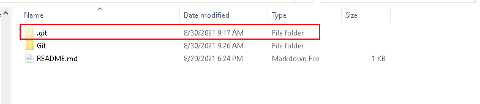

## Como obter um repositório Git 

existem duas maneiras de obter um repositório Git, fazendo com que seu projeto comece a ser monitorado por esse VCS:

1. Iniciar um repositório Git em um diretório já existente e que não está sendo versionado;
2. Clonar um repositório que já existe


Na primeira opção , vamos dizer ao git para monitorar um diretório criado anteriormente. Para isso navegue até o diretório com o comando **cd** e digite :

```
$ git init
```

Surgirá um subdiretório oculto chamado .git. É importante notar que o controle de versão só estará completo depois de alguns comandos que serão mostrados mais a frente. Até agora, foi criada a estrutura básica de um repositório Git.

<div align="center"></div>

A segunda forma clona/copia um repositório que já existe em algum outro lugar como por exemplo no GitHub. Para isso use o comado:

```
$ git clone <url>
```

**Exemplo**: git clone https://github.com/Dev-allanSantos/BlogGitHub.git (este comando clona o repositório BlogGitHub)

#### Como obter a url do repositório ? :link:

Siga estes passos:

1. Entre no GitHub e navegue até o repositório que você deseja clonar
2. Clique na opção Code (botão verde no canto superior direito da tela)

<div align="center"></div>


3. copie a url 

   <div align="center"></div>

   

