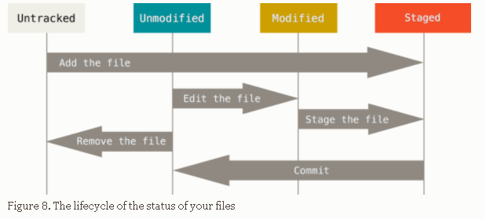
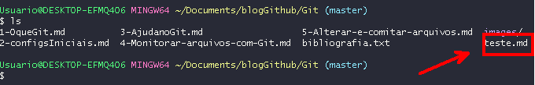
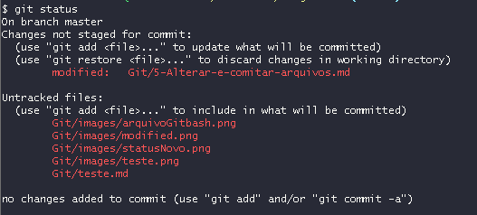

<div align="center"><h2>Alterar e comitar arquivos</h2></div>

Os documentos presentes no working directory podem estar em dois estados fundamentais:

1. **Tracked**: são arquivos que o git já monitora e portanto já estiveram no staging area e foram comitados. Os arquivos neste status ainda podem ser : **unmodified, modified ou staged** .

   

   unmodified: não há alterações desde o último commit.

   modified: os arquivos foram alterados , mas ainda não foram comitados.

   staged: arquivos selecionados para o próximo commit.


2. **Untracked**: arquivos que o git não monitora. Quando um documento novo é criado ele recebe o status de untracked.


<div align="center"></div>


Quando um repositório Git é inicializado em um diretório novo, todos os arquivos já existente estarão no status **untracked** , o que significa que o Git não os conhece. Para começar o versionamento de fato é preciso que o comando ``git add . `` seja declarado. Este comando pegará todos os arquivos modificados e untracked presentes no working directory e os direcionará para a staging area, onde estarão prontos para o próximo commit. Então , declare ``git commit -m "mensagem"`` para realizar o commit.

O fluxo fica assim :

1. altera e adiciona novos arquivos
2. usa ``git add .`` para preparar os arquivos
3. usa ``git commit -m "mensagem"`` para comitar

obs: o comando git add também pode ser especificado para adicionar um arquivo ou diretório:

```
//adiciona o arquivo README.md
git add README.md

//adiciona o diretório workspace , subdiretórios e arquivos
git add workspace/

//pesquisa o manual do comando git add
git help add
git add --help
```

 

**Exemplo prático**

para este exemplo usarei este repositório que já foi inicializado com Git e realizaremos as seguintes tarefas:

1. adicionar um novo arquivo *.md e verificar o status
2. alterar um arquivos já existente e verificar o status
3. commitar as alterações


**Etapa 1**

Na raiz do meu repositório existem os seguintes arquivos:

- .git/

- Git/
- README.md


<div align="center"></div>

Criarei o arquivo teste.md através da linha de comando do Git bash e escreverei o seguinte dentro dele: "criei um novo arquivo".


<div align="center"></div>

Vamos listar com o comando `ls ` os arquivos e diretórios dentro do diretório Git para ver se teste.md foi criado.

<div align="center"></div>

Com o comando `git status` é possível verificar os status dos seus arquivos. Como teste.md é um arquivo novo o Git ainda não o conhece e por isso o provável status deve ser **untracked** .


 <div align="center"></div>

Perceba também que foram adicionados novos arquivos além de teste.md .


**Etapa 2**

Neste diretório existe um arquivos chamado "5-Alterar-e-comitar-arquivos.md". Cada palavra que estou digitando agora modifica este arquivo em relação ao  último commit, que é como o Git lembra dele. Portanto ao digitar o comando `git status ` poderemos ver o status de **modified** que acompanha este arquivo.

<div align="center"></div>


Este é output completo do comando git status neste exato momento:


<div align="center"></div>

**Etapa 3**

Nesta etapa é preciso comitar, ou seja, salvar de forma permanente, esse novos arquivos e as alterações. O próximo passo no fluxo, é levar esses documentos para a staging area, pois ela contem os arquivos que devem fazer parte do próximo commit. Para fazer isso  usarei o comando `git add .`


Por fim,  basta declarar o comando `git commit -m "mensagem"` passando uma mensagem que serve para dizer qual alterações foram feitas e talvez o motivo da alteração.  
