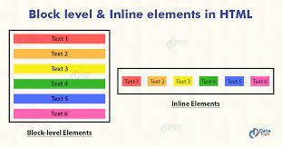
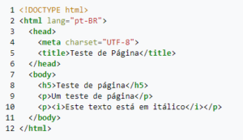
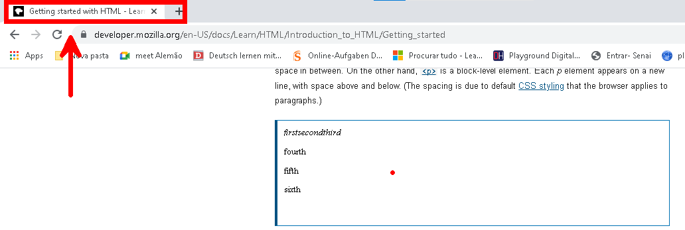

<div align="center"><h2>O que é HTML ?</h2></div>


Html é uma linguagem de marcação formada por elementos. Esses elementos, também conhecidos como tags, são aplicados a partes do texto conferindo lhes significado - (isso é um parágrafo?, isso é uma lista não-ordenada?). Isso quer dizer que, através do html dizemos ao navegador como estruturar os elementos presentes na nossa página


<div aligin="center" width="500px"></div>

​																		(estruturando uma página com html)


### Estrutura dos elementos html 

A maioria dos elementos html segue a seguinte estrutura:


<div align="center"></div>


1. **tag de abertura:** define o início do elemento e portanto o inicio de seu efeito. tags de aberturas são formadas pelo nome da tag entre o sinal de menor e o sinal de maior.


2. **conteúdo**


3. **tag de fechamento:** indica o final de um elemento html. Sua estrutura é muito semelhante a tag de abertura, sendo a única diferença a adição de uma barra normal antes do nome da tag.


### Aninhando elementos

Aninhar significa que alguns elementos html podem possuir em seu conteúdo outros elementos.

**exemplo:**

``` html
<p>
     meu cachorro é <strong>muito</strong> brincalhão
</p>
```


perceba a tag `<strong>` aninhada no elemento `<p>` . **Importante :** o elemento filho deve ter sua tag de fechamento declarada antes da tag de fechamento do elemento pai, caso contrário o navegador poderá não ser capaz de executar esta estrutura.


**exemplo errado :**

```html
<p>
     meu cachorro é <strong>muito brincalhão
</p> </strong>
```

  


### Elementos a nível de bloco e elementos a nível de linha

Os elementos html possuem pelo menos duas categorias principais:

1. **elementos de nível de bloco:** são elementos que geram uma nova linha e ocupam todo o espaço horizontal disponível uma linha inteira. Dessa forma, uma sequência de elementos de nível de bloco é disposta de modo que os elementos ficam empilhados. Normalmente, estes elementos definem grandes blocos de estrutura do documento html e por essa razão são chamados de containers. exemplos de [elementos de nível de bloco](https://developer.mozilla.org/en-US/docs/Web/HTML/Block-level_elements#elements)

2. **elementos inline:** Seu conteúdo não é gerado em uma nova linha. Quando temos vários elementos inline eles são dispostos lado a lado. Usualmente , estes elementos estão aninhados em elementos de nível de bloco. exemplos de [elementos de inline](https://developer.mozilla.org/en-US/docs/Web/HTML/Inline_elements)

   

<div align="center"> </div>


### Atributos


elementos html também possuem atributos. Os atributos são informação extra sobre o elemento e essas novas informações não alteram o conteúdo do elemento.


**Exemplo:** 

​	O elemento âncora `<a>` , responsável por direcionar o usuário para outra página, pode vir acompanhado dos seguintes atributos:

*  **href **: aponta o endereço da página para qual o usuário será redirecionado quando clicar no link
* **title:** define uma pequena descrição da página linkada. Seu efeito pode ser observado quando o usário passar o mouse sobre o link
* **target:** define a forma como essa página será aberta pelo navegador, podendo escolher entre carregar o link na mesma janela ou abrir o link em outra janela no navegador.


#### Como escrever os atributos ? 

Declarar atributos exigem algumas regras básicas a serem seguidas. Veja algumas abaixo:


1. Atributos são declarados na tag de abertura
2. Separe os atributos dando um espaço entre eles
3. Logo após o nome do atributo insira um sinal de igual 
4. O valor desejado para o atributo é  escrito, respeitando boas práticas, entre aspas simples ou asplas duplas.


**Exemplo**

```html
<a href="https://github.com/Dev-allanSantos/BlogGitHub" title="repositório do GitHuB" target="_blank"> link do repositório</a>
```

<a href="https://github.com/Dev-allanSantos/BlogGitHub" title="repositório do GitHuB" target="_blank"> link do repositório</a>


### Estrutura do documento HTML


Todo documento html possui a seguinte estrutura que permite seu funcionamento:


<div align="center"> </div>


`<!DOCTYPE html> `: indica o tipo do documento que é html. Antigamente este tag era uma link que direcionava para outra página . Esta outra página continha um conjunto de regras que definia as boas práticas de um arquivo html. Atualmente, este link não existe mais, no entanto mesmo assim a tag  `<!DOCTYPE html>` é fundamental para o funcionamento do html.


`<html></html>` : esta tag, também conhecida como root, contém todo o documento html.


`<head></head>`: a tag head é um container onde é possível declarar informações sobre o documento html que não serão exibidas no navegador do usuário. Estas informações normalmente são dados de configuração.

`<meta charset="utf-8">`:  define o conjunto de caracteres utilizado no documento .


`<title></title> ` : corresponde ao título da página e será exibido na aba da janela do navegador.


<div align="center"> </div>


`<body></body>  `: contem os elementos que serão exibidos quando o usuário navegar pela página através do navegador. 


Confira a referência na qual este texto se baseou ou utilizou o material : [mdn web docs](https://developer.mozilla.org/en-US/docs/Learn/HTML/Introduction_to_HTML/Getting_started)
