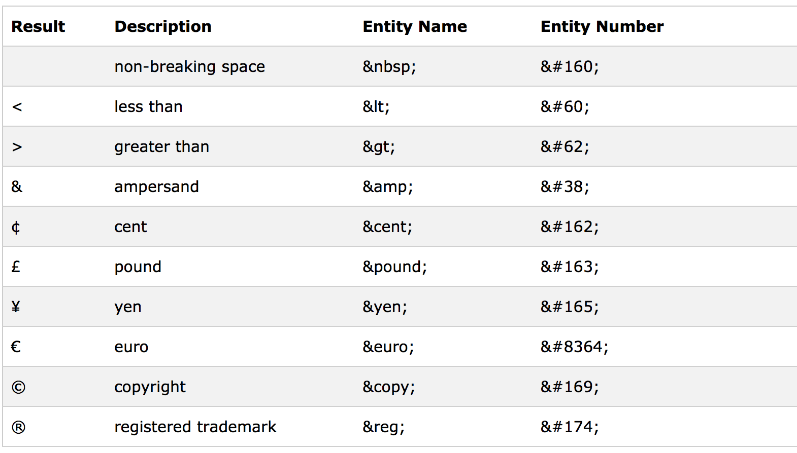

<div align="center"><h2>Entidades HTML</h2></div>


Na linguagem do Html existem certos caracteres especiais que desempenha um papel específico na linguagem. Alguns desses símbolos são: `<` , `>`, `"`  ,`'` `&`  


Se esses elementos fazem parte da sintaxe da linguagem , como podemos utilizá los em um texto sem que o html os intreprete como um caractere especial ? Com o uso de entidades do html é possível realizar essa tarefa.


As entidades html são estruturas que fazem referência  a determinados caracteres especiais do html e é dessa forma que o html entente que aquele símbolo não faz parte de sua sintaxe. Toda entidade html inicia se com `&` e finaliza com `;` .


Digamos que você deseja escrever um parágrafo com o conteúdo : "parágrafos são definidos entre as tags `<p>`" . De primeira é possível pensar que o exemplo abaixo executa a tarefa da forma correta:


```html
<p>parágrafos são definidos entre as tags <p></p> </p>
```


No exemplo acima , o html interpreta as tags `<p></p>` como um novo elemento . A forma correta de se fazer isso seria:


```html
<p>parágrafos são definidos entre as tags &lt;p&gt;&lt;&sol;p&gt; </p>
```


<div align="center"></div>

