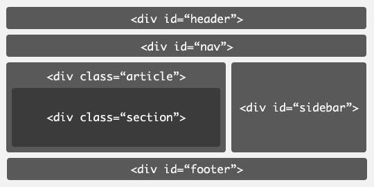

# Semântica no HTML5:pencil:

Neste texto vamos discutir sobre alguns elementos implementados no html 5 com o objetivo de dar significado as partes do documento html.

## Versões anteriores do html

Antes da versão cinco do html, o elemento predominante eram as Divs. Divs são elementos de bloco genéricos e são utilizados como container para algum conteúdo, portanto, divs não tem muito significado . Para diferenciar um container de outros era utilizado o atributo class ou id , dentro do elemento div, com o nome de um seção do site. Veja um exemplo abaixo :

 
  

O html 5 trouxe novos elementos semânticos que dão significados especiais as partes de um website, são alguns deles:

- `<header> </header>`: está tag contem o cabeçalho da página principal ou de uma seção do documento. Normalmente , no header são inseridos logo, menu de navegação, barras de pesquisas e etc.

- `<nav></nav> `: seção com o menu de navegação principal do site., contento links que direcionam para outras páginas da aplicação.

- `<main></main> ` : é o container no qual todo conteúdo principal da página está inserido . Este pode ser dividido em várias sub-seções  com ` <article> , <section> ou 
`.

- `<article></article>` : container que representa um conteúdo independente e que faz sentido por si só. Alguns exemplos são: comentário em uma seção de comentários de um blog, artigo de um jornal, uma pergunta enviada por um usuário em um fórum.

- `<section></section>` : pode ser usado para juntar seções ou conteúdos que possuem uma funcionalidade ou um assunto em comum. Por exemplo: em um site de notícias, a seção de esportes estaria em uma `<section>` , enquanto a seção de política estaria em outra `<section>`.

- `<aside></aside>` : Utilizado para envolver conteúdos que fornecem informações adicionais sobre o conteúdo principal. Exemplos: links que direcionam para outras páginas , propagandas, biografia sobre o autor.

- `<footer></footer>` : representa o rodapé do conteúdo e de outras seções como `<article>` e `<section>` . O `<footer>` pode conter um menu de navegação e informações sobre o autor/ organizador da página.  

  

## Por que elementos semânticos ?

Alguns dos elementos acima dão um significado especial para algumas seções de um website, o que por sua vez aumenta a acessibilidade . Como ? leitores de tela , utilizados por pessoas com algum tipo de deficiência visual, vão navegar pelo seu site de acordo com as seções que ele possuí. Se o seu documento html for construído de forma a respeitar a semântica dos elementos , os usuários poderão navegar de um forma melhor através do seu site e por consequência serão direcionados para a seção desejada.

## Estrutura do HTML4 vs HTML5

Veja as diferenças entre a estrutura da página em versões distintas do HTML:

