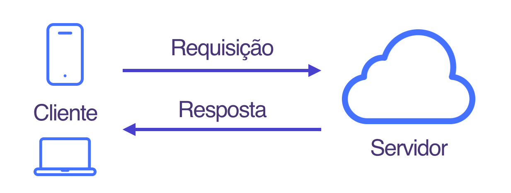

## Como a web funciona 

Você já se perguntou ou teve curiosidade em saber o que acontece por trás das cortinas quando você acessa um site pelo navegador ? Eu tentarei mostrar de uma forma simplificada e resumida o que acontece.

leia o texto no qual me baseei e retirei a maioria dos exemplos: [how the web works - mdn docs](https://developer.mozilla.org/en-US/docs/Learn/Getting_started_with_the_web/How_the_Web_works)  

**tipos de computadores**

Em uma rede de computadores existem diferentes tipos de dispositivos de acordo com a função que eles exercem na rede. Os dois principais são:

* **Clientes**: são os dispositivos que consomem arquivos e serviços presentes em uma rede. Exemplo: computadores de usuários comuns conectados a internet e que acessam um website através do navegador.
* **Servidores**: computadores que fornecem arquivos e serviços web para clientes. Os servidores costumam ser dispositivos com hardware mais robusto com grande capacidade de processamento e memória.  Exemplo: cliente requisita acesso a um website e o servidor envia ao cliente uma copia do site para a maquina local do cliente e assim, a página pode ser exibida pelo navegador.

