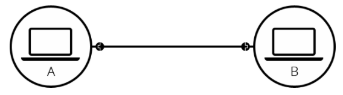
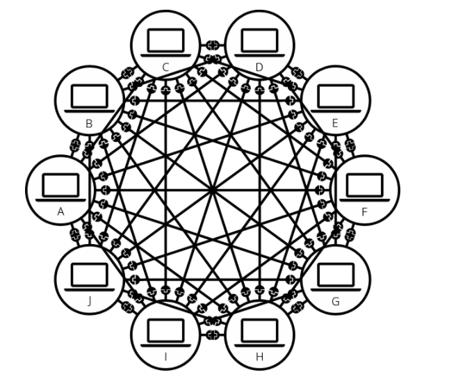
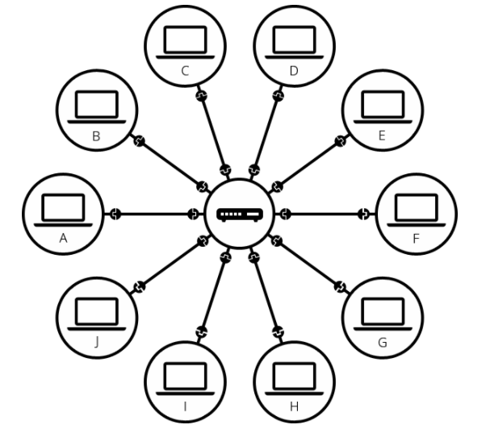
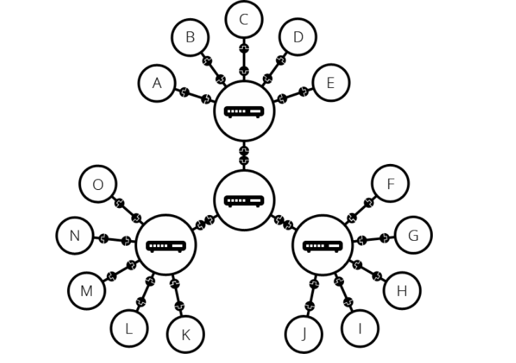
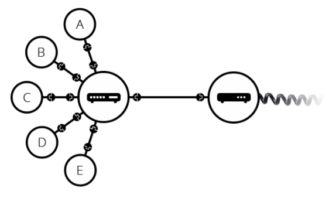
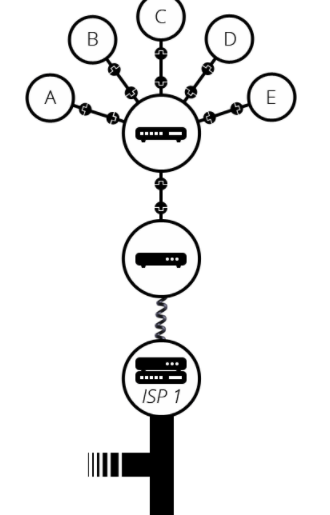
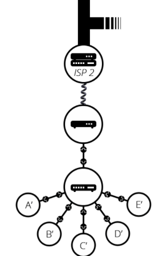

<h1>Como funciona a Internet (resumo)</h1>

A internet é uma grande rede global de computadores conectados, em outras palavras, a maior rede que existe e é por meio  dessa grande infraestrutura  que a **Web**  é construída.

 **Internet** e **Web** são conceitos que representam diferentes coisas, enquanto a internet é uma rede global de computadores a web são os serviços construídos em cima dessa rede. 

 
 Estruturas 🦴 

 ### Estruturas de rede

Para construir uma rede é necessário que ao menos dois computadores estejam conectados entre si , seja via cabo Ethernet ou via rede sem fio. Esta unidade configura um rede chamada, **rede ponto-a-ponto (peer-to-peer)** , a menor rede possível. 

A troca de dados e serviços entre esses dois computadores foi como a internet começou.

Normalmente, uma rede não é composta somente por dois computadores, na verdade é possível adicionar quantos  forem necessários. Digamos, que você deseja conectar 10 computadores, de forma que cada um esteja conectado com todos os outros. Seria necessário 45 cabos e 9 plugs/portas em cada computador. Neste exemplo, a troca de dados ocorre entre todos os computadores , mas apresenta desvantagens. A instalação e manutenção de uma rede parecida com o exemplo abaixo é difícil  e representaria um grande esforço e custo , imagine, por exemplo, manter instalar essa rede entra 250 dispositivos. Como podemos simplificar isso ?  

Para simplificar esta topologia  é preciso usar um **roteador**. Este dispositivo especial é responsável por receber as informações de um computador e garantir que essa informações cheguem no computador de destino. Por exemplo, se pcA deseja enviar uma mensagem ao computador B , o pc A deve enviar a mensagem para o  roteador e , então, a mensagem é encaminhada para o pc B.

Nessa topologia, é necessário apenas dez cabos e um plug/porta em cada computador.
 

 
 
 Como o roteador consegue enviar a mensagem para o destino correto ? 

 
  
Através de um endereço lógico chamado **ip**. O ip pode ser entendido, de forma análoga , ao endereço da sua casa. O endereço residencial identifica unicamente sua  casa no meio de tantas outras e é este endereço que serviços de entrega consultam na hora de entregar uma encomenda destinada à você.

Em redes, o endereço ip é também um identificador único que representa um dispositivo na rede e dessa forma, todos dispositivos conectados a uma rede devem adquirir um número de ip. Este endereço é representado por quatro números decimais inteiros separados por `.` , por exemplo: **192.168.0.1 / 172.16.0.8 ou 10.0.0.2**   .

**Exemplo**

O computador C deseja enviar pacotes para o computador D. Para isso , o computador C envia esse pacote para o roteador com endereço de ip destino, que representa o dispositivo que deve receber o pacote. O roteador lê o endereço de destino e consulta em sua tabela para ver se ele conhece esse dispositivo ou o roteador mais próximo que possivelmente conhece o computador alvo. Caso o roteador ache alguma correspondência , ele encaminha o pacote em direção ao destino.

Em resumo é o endereço ip que garante que um determinado pacote alcance um destino pré-determinado.

 
Redes de redes 	🕸️

 

A internet é formada por milhares de redes e por isso um único roteador não daria conta de sustentar todas conexões permitidas pela Internet. Mas então, como é possível resolver este problema ? Uma das soluções é conectar as pequenas redes entre si através dos roteadores, dessa forma seria possível que um rede se comunique com outra rede , permitindo o escalonamento necessário para sustentar tantas conexões.

 A rede demonstrada acima se aproxima um pouco do que se conhece por internet , mas ainda faltam alguns fatores. Como é possível  que da sua rede local você se conecte com outras pessoas em diferentes partes do mundo? Para tal tarefa seria necessário criar toda uma infraestrutura de cabeamento que conectasse minha rede as redes que eu preciso alcançar. A boa notícia é que  cabeamento de telefone já fornece a infraestrutura necessária . 

  

 O dispositivo conectado ao roteador chama-se **modem** e ele é responsável por conectar nossa rede como o cabeamento de telefone. O próximo passo seria fazer com que nossa rede alcançasse a rede de um **ISP** (Internet Service Provider).  Um ISP é uma empresa que gerencia alguns *roteadores* especiais que estão todos interligados e também podem acessar roteadores de outros ISPs. Assim nossa mensagem é enviada através dessa redes do ISP até a rede de destino.  

  

  

Esta foi uma breve simplificação dos caminhos e da infraestrutura exigida pela Internet.
